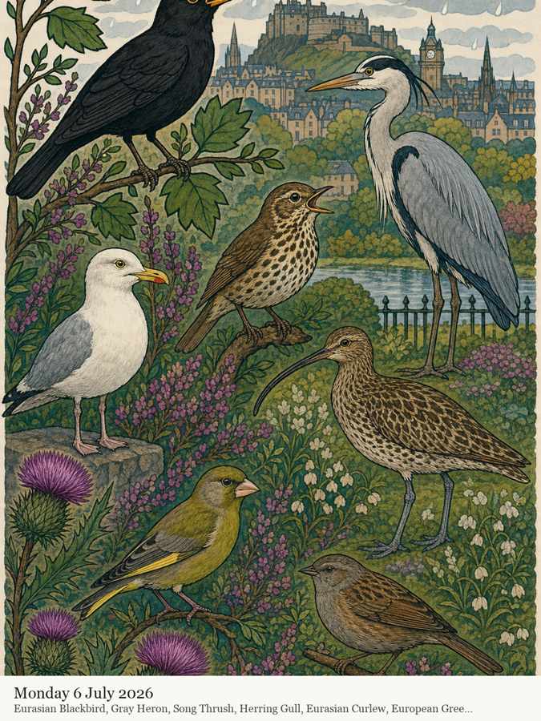

# birdframe

Listen to the birds outside your window, identify them with
[BirdNET](https://github.com/birdnet-team/birdnet), and turn each day's birdlife
into a stylised AI painting — posted to a shared
[Inky Frame](https://github.com/ddrayne/inky-frame) e-ink display and kept as
your own growing bird census.

It runs quietly in the background on a Mac: a menu-bar app plus a local web
dashboard, with a continuous *audio → BirdNET → SQLite → gpt-image → frame*
pipeline. Audio is analysed in memory and never written to disk (only short
best-of clips per species are kept, so you can listen back).

<p align="center">
  
</p>

<p align="center"><em>A day at the window, painted: blackbird, heron, song thrush,
gull, curlew, greenfinch and dunnock over the Edinburgh skyline.</em></p>

### The dashboard

The dashboard is a personal field journal rather than a raw event monitor:

- **Today** is the living page: the latest voice, the day’s story and pulse,
  first-ever visitors, saved recordings, and every detection in clear
  confirmed / probable / tentative layers.
- **Journal** reopens any listening day with its artwork, 15-minute
  soundscape, species-aware hourly rhythm, recordings, discoveries, and full
  roll call.
- **Species** is the life list. Every species has a permanent dossier with
  day-by-day history, time-of-day pattern, confidence profile, recordings,
  co-occurring soundscapes, raw matches, and artwork appearances.
- **Patterns** reveals the long view: volume, richness, unusual voices,
  day-by-hour heatmaps, and a searchable “soundscape score” showing when each
  species is active through the 24-hour day.
- **Pictures** is a visual studio in three rooms: **Editions** preserves each
  artwork with its exact prompt and the reason its style was chosen;
  **Reimagine a day** can return to any listening date and reveal its acoustic
  fingerprint before painting another interpretation; and the **Style
  library** holds 21 editable, historically grounded and data-native
  directions.
  **Settings** keeps health and configuration out of the journal itself.

Charts expose exact counts and species composition on hover or tap. The full
archive remains visible throughout; filters derive views without changing or
discarding stored detections.

## What it does

- **Listens continuously** and identifies birds, filtered to species plausible
  at your location and season (BirdNET's geo model).
- **Judges its own confidence.** Every detection is weighed on three axes —
  how clearly it was heard, how likely it is here, and how often — into a
  **confirmed / probable / tentative** tier with plain-language reasons.
  Doubtful detections are shown but cordoned off, and kept out of the artwork.
- **Records a clip** of the best detection per species per day — press play and
  hear the actual bird (and tell real ones from a mishearing).
- **Paints the day.** Once a day (or on demand) it composes the day's confident
  birds into a picture with OpenAI gpt-image. A responsive art director matches
  the day's timing, richness, weather, balance, and first arrivals to one of 21
  fully editable visual traditions; rotation and a pinned house style remain
  available. Detection volume controls rhythm and density, never a fictional
  count of individual birds.
- **Builds a census.** A life list with first-heard dates, an all-time daily
  rhythm chart, totals, and CSV export.
- **Tells the story.** A short LLM-written line about each day's birdsong.
- **Stays out of your way, tells you when it matters** — menu bar status, a
  health panel, and macOS notifications for a new life-list bird, a lost mic, or
  a frame it can't reach.

The dashboard is installable as a PWA and reachable from your phone on the same
network.

**Requirements:** macOS (Apple Silicon or Intel) and [Homebrew](https://brew.sh).
Python 3.12 is fetched automatically by `uv` — you don't need it pre-installed.

## Install (one line)

```sh
git clone https://github.com/ddrayne/birdframe && cd birdframe
./install.sh
```

The installer sets up `uv` + `libsndfile`, syncs dependencies, offers to store
your OpenAI key, runs a setup check, installs the background service, and creates
a **Birdframe.app** in `~/Applications`. Grant microphone access when macOS asks.

Then open the dashboard at **http://localhost:8355** — or, on your phone on the
same network, the LAN URL printed at startup. Double-clicking **Birdframe.app**
(Spotlight → "Birdframe") ensures it's running and opens the dashboard.

Set your **location** and everything else in the dashboard's **Settings** tab.
Without an OpenAI key birdframe still runs and posts a tidy text poster instead
of a painting; the key lives in the macOS Keychain (or the `OPENAI_API_KEY`
environment variable).

### Manual setup

```sh
brew install uv libsndfile
uv sync --extra dev
uv run birdframe set-key      # optional; store the OpenAI key
uv run birdframe doctor       # check location, key, mic, frame
uv run birdframe              # run in the foreground
```

## Running as a service

birdframe manages its own macOS LaunchAgent — no `launchctl` needed:

```sh
uv run birdframe install      # start at login and keep running (restarts on crash)
uv run birdframe status       # is it installed / running?
uv run birdframe restart      # after changing restart-required settings
uv run birdframe stop         # / start
uv run birdframe logs         # follow the log
uv run birdframe uninstall    # remove the service (data & settings untouched)
uv run birdframe make-app     # (re)create ~/Applications/Birdframe.app
```

Logs: `~/Library/Logs/birdframe.log`. Data (SQLite, images, clips):
`~/.local/share/birdframe/`. Settings: `~/.config/birdframe/config.toml`.

birdframe creates a transactionally consistent SQLite snapshot every day under
`~/.local/share/birdframe/backups/` and keeps 30 days by default. This uses
SQLite's online backup API, so committed WAL data is included safely while the
listener continues running. Use `uv run birdframe backup` or **Back up now** in
Settings for an extra restore point; change `backup_keep_days` in Settings to
adjust retention (0 keeps snapshots forever).

To restore, stop birdframe first, preserve the current
`birdframe.sqlite` under another name, copy the chosen snapshot into its
place, and start birdframe again. Never replace the live database while the
listener is running.

## Tips

- Detection quality is capped by the microphone. Through double glazing it only
  catches loud, close birds — a cheap USB mic near or outside the window helps
  more than any setting.
- Heard a surprising bird? Play its clip. If it's a mishearing, click **not
  here** to veto it.

## Tests

```sh
uv run pytest                 # full suite (no model download or API spend needed)
BIRDFRAME_SMOKE=1 uv run pytest tests/test_smoke.py -s   # opt-in real-model check
```

CI runs the suite on macOS via GitHub Actions.

## License

birdframe's code is [MIT-licensed](LICENSE). It builds on
[BirdNET](https://github.com/birdnet-team/birdnet) (library MIT); note that the
**BirdNET models** are licensed
[CC BY-NC-SA 4.0](https://creativecommons.org/licenses/by-nc-sa/4.0/) —
**non-commercial** use — so review those terms before any commercial use.
Generated images are subject to your image provider's usage terms.
