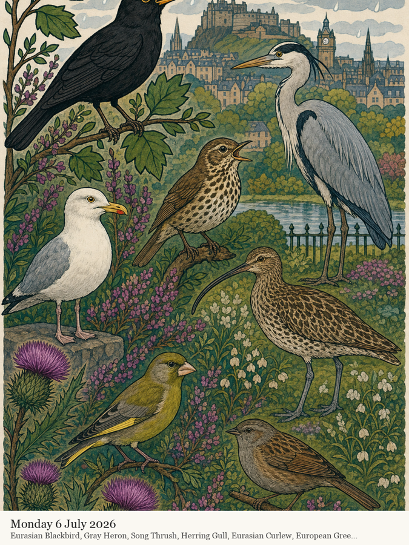

# birdframe

Listen to the birds outside your window, identify them with
[BirdNET](https://github.com/birdnet-team/birdnet), and turn each day's birdlife
into a stylised AI painting — posted to a shared
[Inky Frame](https://github.com/ddrayne/inky-frame) e-ink display and kept as
your own growing bird census.

It runs quietly in the background on a Mac (a menu-bar app plus a local web
dashboard) or on a Raspberry Pi (just the dashboard, which is made for your
phone), with a continuous *audio → BirdNET → SQLite → gpt-image → frame*
pipeline. Audio is analysed in memory and never written to disk (only short
best-of clips per species are kept, so you can listen back). The Inky frame
is optional, and the journal can be published as a public website.

<p align="center">
  
</p>

<p align="center"><em>A day at the window, painted: blackbird, heron, song thrush,
gull, curlew, greenfinch and dunnock over the Edinburgh skyline.</em></p>

### The dashboard

The dashboard is a personal field journal rather than a raw event monitor:

- **Today** is the living page: the latest voice, the day’s story and pulse,
  first-ever visitors, saved recordings, and every detection in clear
  confirmed / probable / tentative layers.
- **Journal** reopens any listening day with its artwork, 15-minute
  soundscape, species-aware hourly rhythm, recordings, discoveries, and full
  roll call.
- **Species** is the life list. Every species has a permanent dossier with
  day-by-day history, time-of-day pattern, confidence profile, recordings,
  co-occurring soundscapes, raw matches, and artwork appearances.
- **Patterns** reveals the long view: volume, richness, unusual voices,
  day-by-hour heatmaps, and a searchable “soundscape score” showing when each
  species is active through the 24-hour day.
- **Pictures** is a visual studio in three rooms: **Editions** preserves each
  artwork with its exact prompt and the reason its style was chosen;
  **Reimagine a day** can return to any listening date and reveal its acoustic
  fingerprint before painting another interpretation; and the **Style
  library** holds 21 editable, historically grounded and data-native
  directions.
  **Settings** keeps health and configuration out of the journal itself.

Charts expose exact counts and species composition on hover or tap. The full
archive remains visible throughout; filters derive views without changing or
discarding stored detections.

## What it does

- **Listens continuously** and identifies birds, filtered to species plausible
  at your location and season (BirdNET's geo model).
- **Judges its own confidence.** Every detection is weighed on three axes —
  how clearly it was heard, how likely it is here, and how often — into a
  **confirmed / probable / tentative** tier with plain-language reasons.
  Doubtful detections are shown but cordoned off, and kept out of the artwork.
- **Records a clip** of the best detection per species per day — press play and
  hear the actual bird (and tell real ones from a mishearing).
- **Paints the day.** Once a day (or on demand) it composes the day's confident
  birds into a picture with OpenAI gpt-image. A responsive art director matches
  the day's timing, richness, weather, balance, and first arrivals to one of 21
  fully editable visual traditions; rotation and a pinned house style remain
  available. Detection volume controls rhythm and density, never a fictional
  count of individual birds.
- **Builds a census.** A life list with first-heard dates, an all-time daily
  rhythm chart, totals, and CSV export.
- **Tells the story.** A short LLM-written line about each day's birdsong.
- **Stays out of your way, tells you when it matters** — menu bar status, a
  health panel, and macOS notifications for a new life-list bird, a lost mic, or
  a frame it can't reach.
- **Repairs its own audio pipeline.** It distinguishes a genuinely quiet window
  from a stale or flat USB feed, reopens the microphone after disconnects and
  CoreAudio faults, and asks launchd for a clean process when BirdNET itself
  stops making progress.

The dashboard is installable as a PWA and reachable from your phone on the same
network.

**Requirements:** macOS (Apple Silicon or Intel) and [Homebrew](https://brew.sh),
or a Raspberry Pi 4/5 with 64-bit Raspberry Pi OS ([below](#on-a-raspberry-pi)).
Python 3.12 is fetched automatically by `uv` — you don't need it pre-installed.

## Install (one line)

```sh
git clone https://github.com/ddrayne/birdframe && cd birdframe
./install.sh
```

The installer sets up `uv` + `libsndfile`, syncs dependencies, offers to store
your OpenAI key, runs a setup check, installs the background service, and creates
a **Birdframe.app** in `~/Applications`. Grant microphone access when macOS asks.

Then open the dashboard at **http://localhost:8355** — or, on your phone on the
same network, the LAN URL printed at startup. Double-clicking **Birdframe.app**
(Spotlight → "Birdframe") ensures it's running and opens the dashboard.

Set your **location** and everything else in the dashboard's **Settings** tab.
Without an OpenAI key birdframe still runs and posts a tidy text poster instead
of a painting; the key lives in the macOS Keychain (or the `OPENAI_API_KEY`
environment variable).

### Manual setup

```sh
brew install uv libsndfile
uv sync --extra dev
uv run birdframe set-key      # optional; store the OpenAI key
uv run birdframe doctor       # check location, key, mic, frame
uv run birdframe              # run in the foreground
```

## Running as a service

birdframe manages its own macOS LaunchAgent — no `launchctl` needed:

```sh
uv run birdframe install      # start at login and keep running (restarts on crash)
uv run birdframe status       # is it installed / running?
uv run birdframe restart      # after changing restart-required settings
uv run birdframe stop         # / start
uv run birdframe logs         # follow the log
uv run birdframe uninstall    # remove the service (data & settings untouched)
uv run birdframe make-app     # (re)create ~/Applications/Birdframe.app
```

Logs: `~/Library/Logs/birdframe.log`. Data (SQLite, images, clips):
`~/.local/share/birdframe/`. Settings: `~/.config/birdframe/config.toml`.

The service is designed for unattended, continuous operation. There are three
recovery layers: the audio watchdog reconnects an unhealthy stream with bounded
backoff and clears a USB input's hidden CoreAudio mute; the process watchdog
exits on a stalled detector so the LaunchAgent can
start a clean model session; and a quiet-hours daily refresh bounds slow native
library or CoreAudio resource creep. **Settings → System health** reports the
changing signal level, last completed audio chunk, and automatic reconnects.
Detection count is not used as an audio health signal—a silent garden is valid
as long as fresh, changing samples continue to arrive.

## On a Raspberry Pi

birdframe also runs headless on Linux, which makes a Raspberry Pi with a USB
microphone a good permanent listener. The same code runs on both; the Pi
simply has no menu bar, so you use the dashboard from your phone.

You need a **Raspberry Pi 5 or 4 (2 GB or more)** running 64-bit Raspberry Pi
OS (Lite is fine) and a USB microphone. Then, on the Pi:

```sh
git clone https://github.com/ddrayne/birdframe && cd birdframe
./install.sh
```

The installer adds PortAudio and a caption font with apt, installs `uv` (which
fetches Python 3.12 for birdframe, whatever the system Python is), syncs the
dependencies, offers to store your OpenAI key, runs `birdframe doctor`, and
installs a **systemd user service** that starts at boot and restarts if it ever
stops. Then open **http://&lt;your-pi&gt;.local:8355** on your phone and add it
to your home screen.

What's different from a Mac:

- **Keys** — a Pi has no Keychain, so `uv run birdframe set-key` stores keys in
  `~/.config/birdframe/secrets.env`, readable only by you (mode 600) and never
  in `config.toml`. Environment variables still take precedence.
- **The service** — `uv run birdframe install | status | restart | logs |
  uninstall` manage `~/.config/systemd/user/birdframe.service`. If
  `birdframe status` says it won't start at boot, run
  `sudo loginctl enable-linger $USER` once.
- **Logs** are in `~/.local/state/birdframe/birdframe.log`
  (`uv run birdframe logs`). Notifications (a new bird, microphone trouble)
  become log lines; the dashboard shows the same health.
- **The microphone** — your user needs to be in the `audio` group (the Pi's
  first user is). `arecord -l` lists devices; pick one under **Settings** if
  the default isn't your USB mic.
- **BirdNET** runs on the lightweight LiteRT runtime; no TensorFlow needed.
- **Sharing a Pi with the Inky frame** — if the frame's own server runs on the
  same Pi, point birdframe at it with `frame_url = "http://localhost:5000"`.

If the model crashes at startup on a Pi 5, add `kernel=kernel8.img` to
`/boot/firmware/config.txt` and reboot. Some native libraries still assume
4 KB memory pages, and the Pi 5's default kernel uses 16 KB pages.

## A public edition of the journal

birdframe can publish a read-only website of your paintings and birds that
anyone can visit: the latest painting hung like a print, notes on the season,
the whole collection by month, a page per bird with a 24-hour "day clock" of
when it sings, and a week-by-week chart of the season. **Frame mode**
(`…/#frame`) shows the latest painting full screen, so any old tablet becomes
a picture frame without an Inky display.

It is a static site: HTML, CSS, JSON and WebP images that any static host can
serve (Cloudflare Pages, GitHub Pages, Netlify, a Raspberry Pi). Nothing on it
can write back to birdframe, and it leaves out what shouldn't leave the house:
coordinates, audio, raw detections, the frame's address, and doubtful
identifications (only confirmed and probable birds appear).

```sh
uv run birdframe publish ~/Sites/birdframe      # build it once, then preview:
python3 -m http.server --directory ~/Sites/birdframe 8356
```

### Free hosting on Cloudflare Pages

birdframe can publish straight to [Cloudflare Pages](https://pages.cloudflare.com),
which hosts static sites free and doesn't limit visits:

1. In a free Cloudflare account, open **My Profile → API Tokens → Create
   Token → Create Custom Token**. Give it one permission,
   **Account · Cloudflare Pages · Edit**, and copy the token. Copy your
   **Account ID** too; it's on the Workers & Pages overview page.
2. Store the token: `uv run birdframe set-key cloudflare`
3. Add to `~/.config/birdframe/config.toml`:

   ```toml
   place_name = "Edinburgh"                  # names the place in prompts and on the site
   cloudflare_project = "edinburgh-window"   # the site becomes edinburgh-window.pages.dev
   cloudflare_account_id = "0123456789abcdef0123456789abcdef"
   ```

4. Install **Node.js 22 or newer**. Cloudflare's uploader, Wrangler, runs on it
   and birdframe fetches Wrangler itself with `npx`.
   - Mac: `brew install node`
   - Raspberry Pi: `curl -fsSL https://deb.nodesource.com/setup_22.x | sudo -E bash - && sudo apt install -y nodejs`
5. Check the setup with `uv run birdframe doctor`, then run
   `uv run birdframe publish`. The first publish creates the project and prints
   its address. After that, restart birdframe and it keeps the site current.

**When it uploads.** Each new painting goes up straight away. Other changes,
such as more birds heard, go up at most every six hours. A restart doesn't
trigger an upload, and after a failed upload birdframe waits half an hour
before trying again. Wrangler sends only the files Cloudflare doesn't already
have, so a typical update is the page plus one new painting.
**Settings → Public site** shows when the site was last built and sent, and
has a **Publish now** button.

**Your own domain.** Add it in the Cloudflare dashboard under your project's
**Custom domains** tab, then set `public_site_url = "https://birds.example.org"`
so link previews use it.

### Other hosts

To publish somewhere else, build into a folder you choose and, optionally,
run your own deploy command after each build:

```toml
public_site_dir = "~/Sites/birdframe"    # rebuilt after each painting, and hourly
public_site_url = "https://example.org"  # optional: for link previews
public_deploy_command = "rsync -a --delete {dir}/ me@example.org:/var/www/birds/"
```

The deploy command runs with `{dir}` replaced by the folder. It is split like
a shell command but never run through a shell, and it follows the same upload
schedule as Cloudflare. The build includes a `_headers` file of caching rules
that Cloudflare Pages and Netlify apply. All of these settings live only in
`config.toml`: the LAN dashboard can trigger **Publish now**, but it can't
change where the site is written or how it's deployed.

**Without an Inky frame**: set `frame_url = ""`. Paintings are still made on
schedule, archived and published; nothing is sent to a display.

## Agent and MCP access

The dashboard includes a read-only analytical API for agents as well as its UI.
FastAPI documents the complete schema at `http://localhost:8355/docs` and
`http://localhost:8355/openapi.json`. Useful endpoints include:

- `GET /api/detections` — raw observations with date/species/confidence filters
- `GET /api/detections?after_id=123&wait=30` — bounded realtime long polling
- `GET /api/rankings?metric=detections` — most frequently detected species
- `GET /api/rankings?metric=earliest_time` — earliest singers
- `GET /api/rankings?metric=rms_dbfs` — loudest detected segments
- `GET /api/rankings?metric=snr_db` — calls most prominent above ambient sound
- `/api/now`, `/api/today`, `/api/census`, `/api/day/{day}`, and
  `/api/species/{common_name}` — live, historical, and species-level context

`birdframe-mcp` wraps those endpoints as a local, read-only MCP server over
stdio. Configure an MCP client to run it from this checkout, for example:

```json
{
  "mcpServers": {
    "birdframe": {
      "command": "/path/to/birdframe/.venv/bin/birdframe-mcp"
    }
  }
}
```

Alternatively run it manually with `uv run birdframe-mcp`. Set
`BIRDFRAME_API_URL` only if the dashboard is not at
`http://localhost:8355`. Exposed tools cover the current soundscape, realtime
waiting, raw queries, rankings, period comparisons, day/species dossiers,
census data, and the retained best clips. Posting, generation, settings, and
blocklisting are intentionally not exposed through MCP.

Counts mean BirdNET detection events or calls, not individual birds. New
detections store only RMS, peak, estimated noise floor, and SNR numbers; raw
audio handling is unchanged and birdframe still keeps at most one best clip per
species per day. Historical rows naturally show `null` for acoustic metrics.

birdframe creates a transactionally consistent SQLite snapshot every day under
`~/.local/share/birdframe/backups/` and keeps 30 days by default. This uses
SQLite's online backup API, so committed WAL data is included safely while the
listener continues running. Use `uv run birdframe backup` or **Back up now** in
Settings for an extra restore point; change `backup_keep_days` in Settings to
adjust retention (0 keeps snapshots forever).

To restore, stop birdframe first, preserve the current
`birdframe.sqlite` under another name, copy the chosen snapshot into its
place, and start birdframe again. Never replace the live database while the
listener is running.

## Tips

- Detection quality is capped by the microphone. Through double glazing it only
  catches loud, close birds — a cheap USB mic near or outside the window helps
  more than any setting.
- Heard a surprising bird? Play its clip. If it's a mishearing, click **not
  here** to veto it.

## Tests

```sh
uv run pytest                 # full suite (no model download or API spend needed)
BIRDFRAME_SMOKE=1 uv run pytest tests/test_smoke.py -s   # opt-in real-model check
```

CI runs the suite on macOS via GitHub Actions.

## License

birdframe's code is [MIT-licensed](LICENSE). It builds on
[BirdNET](https://github.com/birdnet-team/birdnet) (library MIT); note that the
**BirdNET models** are licensed
[CC BY-NC-SA 4.0](https://creativecommons.org/licenses/by-nc-sa/4.0/) —
**non-commercial** use — so review those terms before any commercial use.
Generated images are subject to your image provider's usage terms.
